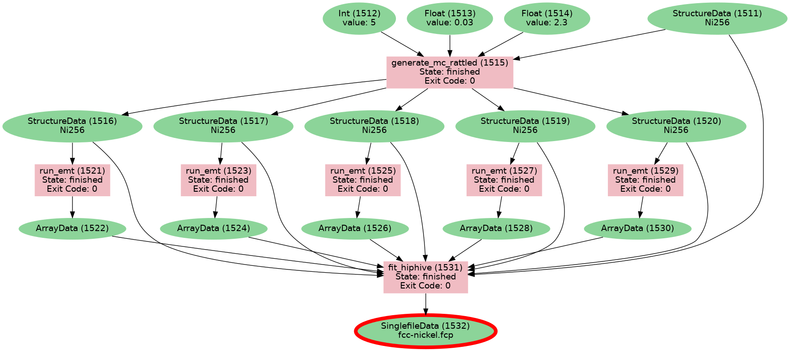

# Example of saving provenance of hiphive fit using AiiDA

**without writing any formal plugin**

Code snippets are taken from: https://hiphive.materialsmodeling.org/tutorial/index.html.

This repository demonstrates how to wrap hiphive routines inside AiiDA's `@calcfunction` and `@workfunction` in order to preserve the result and its provenance. Such functionalities do not require writing any dedicated plugin code, although putting the routines into a Python package may still be highly desirable.

`datagen.py` can be run to generate and store the example fit.

`load-fcp.py` contains example code for loading the force constant potential from an archive export.

To create an archive, run:

```
verdi archive create -N <uuid1> <uuid2> -- hiphive-example.aiida
```


where `<uuid1>` and `<uuid2>` are the UUIDs of the two nodes printed at the end of running `datagen.py`.

Note that running `datagen.py` can be done with a temporary in-memory profile without a fully working AiiDA installation. However, at the moment, it is not possible to export data into an archive from such an in-memory profile.

The `load-fcp.py` can run by any `aiida-core>=2.0` installation; there is no need to install any non-Python dependencies.

Provenance graph:



Example output of `run.py`:

```
======================================================
Created data {'fcp': <SinglefileData: uuid: e3182b58-505b-489b-8097-6df005bc01fe (pk: 1556)>, 'opt': <Str: uuid: 68cf97d4-d751-4d4a-aea0-2707acbeaf3b (pk: 1557) value: ===================== Optimizer ======================
seed                           : 42
fit_method                     : least-squares
standardize                    : True
n_target_values                : 3840
n_parameters                   : 119
n_nonzero_parameters           : 119
parameters_norm                : 0.9275019
target_values_std              : 1.027693
rmse_train                     : 0.01667685
rmse_test                      : 0.01975875
R2_train                       : 0.9997333
R2_test                        : 0.9996649
AIC                            : -28057.89
BIC                            : -27326.29
train_size                     : 3456
test_size                      : 384
======================================================>}
```
