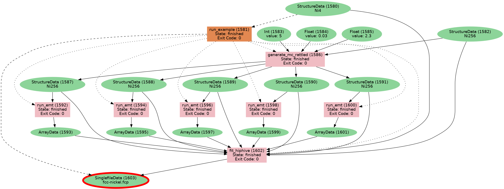

# Example of saving provenance of hiphive fit using AiidA

**with writing any formal plugin** 

`datagen.py` can be run to generate and store the example fit.

`fcp-load.py` contains example code for load the force constant potential from a arhive export.


To create an archive run:

```
verdi archive create -N <uuid1> <uuid2> -- hiphive-example.aiida
```

Where `<uuid1>` and `<uuid2>` are the UUIDs of the two node printed at the end of running `datagen.py`.


Note that running `datagen.py` can be run with a temporary in-memory profile without a  a fully working AiiDA installation. However, at the moment it is not possible to export data into archive from such an in-memory profile. 

The `load-fcp.py` can be run by any `aiida-core>=2.0` installation, there is no need to install any non-python dependencies.


Provenance graph:


